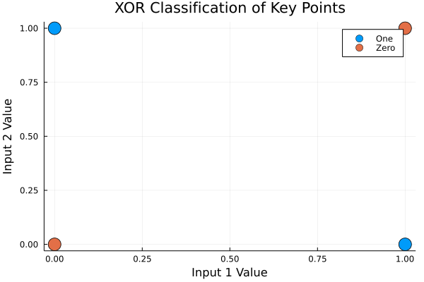
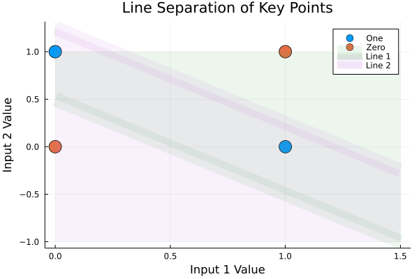
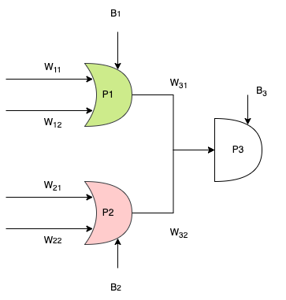

# <center> Perceptron XOR Logic Gate  </center>

## Meta
Author: Parmandeep Chaddha. 
Date: Feb 22, 2022. 

## Objective
Determine the weights and "types" of Perceptrons required to perform the XOR calculation.

## Background
1. The XOR logic applies the following mapping of inputs:
```
(0, 0) => 0
(0, 1) => 1
(1, 0) => 1
(1, 1) => 0
```
2. This maps to the  visual representation in Figure 1.
 
<center> Figure 1: XOR Classification </center>

## Solution
1. Since the perceptron is a linear classifier, we cannot "separate" these points with a SINGLE line. We can, however seperate these points with two lines.

2. Consider Figure 2. These lines were "generated" by: connecting points (0, 0.5) and (0.5, 0) for line 1, and (0, 1.25), (1.25, 0) for line 2. Infinite other points can of course be chosen to create the two lines, as long as distinct regions are created to classify the points. To expand, Region 1 can be considered anything "above" line 2, the green region. Region 2 is the intersection between the pink and green regions. Regions 3 is below, line 1, and consists of the pink region only! To note, the green is generated by line 1, and the pink region is generated by line 2.
 
<center> Figure 1: Two Line Separation </center>

3. Based on Figure 2, it is obvious that the points can only be classified as "1"  if they are both above line 1 and below line 2. That is, points classified as 1 must be located in REGION 2. Since Region 2 is an INTERSECTION of line 1 and line 2, we can create a logic gate/ Perceptron representation of the intersection! Let Line 1 represent the classification by Perceptron 1 (P1), Line 2 represent the classification by Perceptron 2 (P2),  and Perceptron 3 (P3) represent the intersection operation.

4. P1 classifies a point as  "1" if either of the inputs is 1. Conversly,  P2 classifies a point as "1" if either of the inputs is zero. Therefore, these Perceptrons should be represented as "OR" gates in our logic diagram. P3 classifies a point as 1 if and only if both P1 and P2 classify the point as 1. Therefore, P3 should be represented as an "AND" gate because it represents the intersection region of Line 1 and Line 2 and requires both inputs to be "1" . Figure 3 shows this logic structure.

<center> Figure 3: XOR Logic Structure </center>

5. Now that we have the logic structure, we need to define the mathematical boundaries, since the Perceptron must operate mathematically. To do this,  outputs from the perceptron must be binary (0 or 1), with the classification being based on the some criteria. For simplicity, let's use the Signum function that outputs a 1 if the sign of the input is positive, and 0 if the sign of the input is negative or the input is 0. The output of each perceptron can be mathematically represented as shown below:
```Text
O == Output

Perceptron 1
===
O1 = {
	1 if (W11 * X1) + (W12 * X2) + B1 > 0
	0 Otherwise
}
Perceptron 2
===
O2 = {
	1 if (W21 * X1) + (W22 * X2) + B2 > 0
	0 Otherwise
}
Perceptron 3
===
O3 = {
	1 if (W31 * O1) + (W32 * O2) + B3 > 1
	0 Otherwise
}

```

6. **Now that the structure is defined, let's find each weight.**
	1. For simplicity, let's say that W<sub>31</sub> and W<sub>32</sub> are 1. 


	2. Now since P3 is an "and" gate which only ouputs a "1" if both P1 and P2 output 1, and since both W<sub>31</sub> and W<sub>32</sub> are "1", we know that the bias term must be an element in the range (-2, -1) to satisfy the "and" condition. This follows from the fact that Perceptron 3 outputs a 1  if the sum over all inputs is *greater than 1*. Let B<sub>3</sub> = -1.5`.


	3. For Perceptron 1, we must classify any point where either input is "1" as a 1. Therefore, if we keep the equation given by Line 1 (Figure 2), we get that: `y = -1*x + 0.5`.  Rearrange the equation to get: `y + x - 0.5 > 0`. The constants in front of y, x, and b represent W<sub>12</sub>, W<sub>11</sub>, and B<sub>1</sub>, respectively: `W12*X2 + W11*X1 + B1 > 0`. To satisfy the constraint:
		1. W<sub>12</sub> = 1.  
		2. W<sub>11</sub> = 1. 
		3. B<sub>1</sub> = -0.5.

	4. Similarly for Perceptron 2, we must classify any point where either input is "0" as a 1. Keeping the equation given by Line 2 (Figure 2), we get that `y=-x+1.25`. Rearrange the equation to get `y+x-1.25 > 0`. However, we want to classify points **BELOW** Line 2 as 1. Therefore, let's divide by -1 to get: `-y -x+1.25 > 0`. The constants in front of y, x, and b represent W<sub>22</sub>, W<sub>21</sub>, and B<sub>2</sub>, respectively: `W22*X2 + W21*X1 + B2 > 0`.  Therefore:
		1.  W<sub>21</sub> = -1
		2.  W<sub>22</sub> = -1
		3.  B<sub>2</sub> = 1.25
 
7. We can now fill in the XOR logic structure with the appropriate weights:
![[xor_structure_filled.png]]
<center> Figure 4: Filled XOR Logic Structure </center>

## Solution Check
Let's verify that this solution works for each of the four points:
1. (0,0), TARGET = 0:
```Text
O1 = (1 * 0) + (1 * 0) + -0.5
O1 = -0.5 => 0

O2 = (-1 * 0) + (-1 * 0) + 1.25
O2 = 1.25 => 1

O3 = (1 * 0) + (1* 1) - 1.5
O3 = -0.5 => 0

CORRECT!
```
2. (0,1), TARGET = 1:
```Text
O1 = (1 * 0) + (1 * 1) + -0.5
O1 = 0.5 => 1

O2 = (-1 * 0) + (-1 * 1) + 1.25
O2 = 0.25 => 1

O3 = (1 * 1) + (1* 1) - 1.5
O3 = 0.5 => 1

CORRECT!
```
3. (1,0), TARGET = 1:
```Text
O1 = (1 * 1) + (1 * 0) + -0.5
O1 = 0.5 => 1

O2 = (-1 * 1) + (-1 * 0) + 1.25
O2 = 0.25 => 1

O3 = (1 * 1) + (1* 1) - 1.5
O3 = 0.5 => 1

CORRECT!
```
4. (1, 1), TARGET = 0:
```Text
O1 = (1 * 1) + (1 * 1) + -0.5
O1 = 1.5 => 1

O2 = (-1 * 1) + (-1 * 1) + 1.25
O2 = -0.25 => 0

O3 = (1 * 1) + (1 * 0) - 1.5
O3 = -0.5 => 0

CORRECT!
```

## Conclusions
1. The XOR Logic was replicated using 3 Perceptrons.
2. All test points were successfully classified.